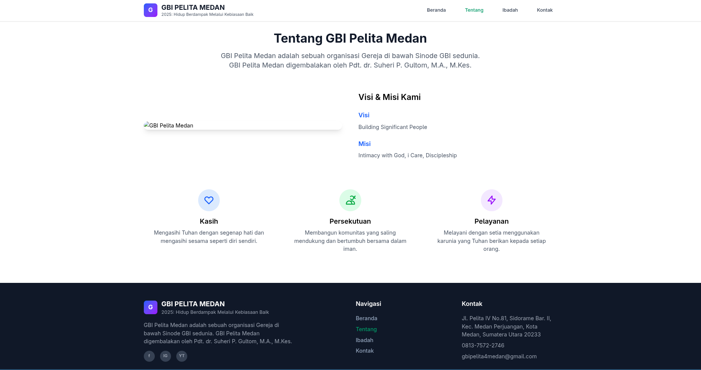
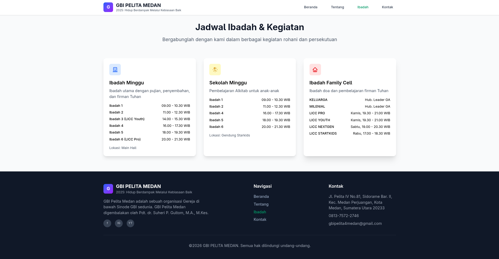
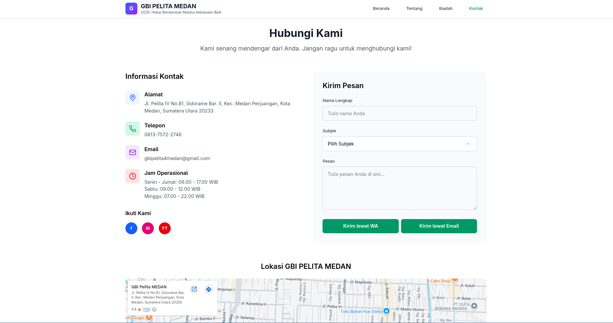

# GBIPELITA-API

   [](#) [](#)

Backend API service for the GBI Pelita ministry management and volunteer scheduling system.

This application handles authentication, volunteer management, ministry divisions, schedule generation, assignment management, and scheduling workflows integrated with a genetic algorithm-based scheduling engine.

The system is designed to automate ministry scheduling processes while minimizing scheduling conflicts and improving assignment distribution across volunteers.

---

## Features

### Authentication & Authorization

- Laravel Sanctum authentication
- Role-based access control
- Permission management using Spatie Laravel Permission
- Protected API routes

### Volunteer Management

- Volunteer data management
- Skill and competency management
- Ministry division management
- User profile management

### Scheduling System

- Schedule period management
- Worship session management
- Volunteer availability management
- Assignment generation and management
- Schedule publishing workflow

### Scheduling Engine

The scheduling engine supports automatic volunteer assignment generation based on:

- Volunteer availability
- Skill compatibility
- Ministry requirements
- Assignment balancing
- Conflict prevention
- Service session grouping

### Queue & Background Jobs

- Asynchronous schedule generation
- Queue-based job processing
- Background task execution

---

## Tech Stack

### Backend

- PHP v8.2
- Laravel v12
- Laravel Sanctum
- Spatie Laravel Permission
- MySQL

### Frontend Monolith

- Vue.js v3
- Inertia.js v2
- Tailwind CSS v4
- Vite v7

### Development Tools

- Laravel Sail
- Laravel Pint
- Laravel Pail
- PHPUnit
- Vite

---

## Project Structure

```txt
app/
├── Http/
├── Jobs/
├── Models/
├── Observers/
├── Providers/
├── Services/
└── Traits/

database/
├── factories/
├── migrations/
└── seeders/

resources/
├── css/
├── js/
└── views/

routes/
├── action.php
├── api.php
├── auth.php
├── console.php
├── department.php
├── division.php
├── module.php
├── role.php
├── schedule-availability.php
├── schedule-period.php
├── schedule.php
├── skill.php
├── user.php
├── volunteer.php
└── web.php
```

---

## Architecture Overview

The application follows a modular architecture approach to improve scalability and maintainability.

Core business logic is separated into modules and services, while queue jobs are used for background scheduling processes and heavy computations.

The system exposes API endpoints for the external frontend client while also providing a lightweight monolithic frontend for public profile-related pages.

---

## Preview

### Public Home Page


### Public About Page


### Public Service Page


### Public Contact Page


---

## Getting Started

### Prerequisites

Make sure the following tools are installed:

- PHP 8.2+
- Composer
- Node.js (LTS recommended)
- npm / pnpm / yarn
- MySQL
- Git

---

## Installation

### 1. Clone Repository

```sh
git clone https://github.com/dimasspanjaitan/gbipelita-api.git
```

### 2. Navigate to Project Directory

```sh
cd gbipelita-api
```

### 3. Install PHP Dependencies

```sh
composer install
```

### 4. Install Frontend Dependencies

```sh
npm install
```

### 5. Configure Environment Variables

Clone `.env.example` and rename it to `.env`.

Example configuration:

```env
APP_NAME=GBIPELITA-API
APP_ENV=local
APP_KEY=
APP_DEBUG=true
APP_URL=http://localhost:8000

DB_CONNECTION=mysql
DB_HOST=127.0.0.1
DB_PORT=3306
DB_DATABASE=gbipelita
DB_USERNAME=root
DB_PASSWORD=

QUEUE_CONNECTION=database
```

### 6. Generate Application Key

```sh
php artisan key:generate
```

### 7. Run Database Migration

```sh
php artisan migrate
```

### 8. Run Database Seeder

```sh
php artisan db:seed
```

---

## Running the Application

### Development Mode

Run Laravel server:

```sh
php artisan serve
```

Run Vite development server:

```sh
npm run dev
```

Run queue worker:

```sh
php artisan queue:listen
```

Application will run at:

```txt
http://localhost:8000
```

---

## Queue System

The scheduling engine relies on Laravel queue workers for background processing.

Make sure queue workers are running before generating schedules:

```sh
php artisan queue:listen
```

Recommended queue driver:

- Database
- Redis

---

## API Integration

This backend service communicates with:

- Next.js frontend client application
- Internal monolithic frontend pages
- Queue workers for scheduling jobs

Authentication is handled using Laravel Sanctum.

---

## Environment Variables

| Variable           | Description             |
| ------------------ | ----------------------- |
| `APP_NAME`         | Application name        |
| `APP_ENV`          | Application environment |
| `APP_URL`          | Application base URL    |
| `DB_DATABASE`      | Database name           |
| `DB_USERNAME`      | Database username       |
| `DB_PASSWORD`      | Database password       |
| `QUEUE_CONNECTION` | Queue driver connection |

---

## Built With

This project leverages the following technologies and libraries:

### Core Backend

- [Laravel](https://laravel.com/) — PHP web application framework
- [PHP](https://www.php.net/) — Server-side scripting language
- [Laravel Sanctum](https://laravel.com/docs/sanctum) — API authentication system
- [Spatie Laravel Permission](https://spatie.be/docs/laravel-permission) — Role and permission management

### Frontend Monolith

- [Vue.js](https://vuejs.org/) — Progressive JavaScript framework
- [Inertia.js](https://inertiajs.com/) — Modern monolith approach for Laravel applications
- [Tailwind CSS](https://tailwindcss.com/) — Utility-first CSS framework
- [Vite](https://vite.dev/) — Frontend build tool

### Utilities & Tooling

- [Axios](https://axios-http.com/) — Promise-based HTTP client
- [Moment.js](https://momentjs.com/) — Date and time utility library
- [Laravel Sail](https://laravel.com/docs/sail) — Docker development environment
- [Laravel Pint](https://laravel.com/docs/pint) — PHP code style fixer
- [Laravel Pail](https://laravel.com/docs/pail) — Log viewer for Laravel
- [PHPUnit](https://phpunit.de/) — PHP testing framework

---

## Deployment

This project can be deployed using:

- Docker
- VPS / Nginx
- Laravel Forge

---

## Project Status

Currently under active development.

---

## License

Distributed under the MIT License. See LICENSE for more information.

---

## Contact

- [GitHub](https://github.com/dimasspanjaitan)
- [LinkedIn](https://www.linkedin.com/in/dimas-s-panjaitan-1821152a9/)

---

## Acknowledgments

Special thanks to everyone involved in the development and ministry scheduling process of the GBI Pelita system.
